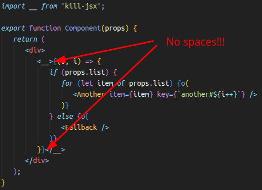

# Kill JSX

This library provides component to use JavaScript features in JSX. It's necessary if you have some conditions in your JSX. By default React using conditional operators, ternary operator and Array.map method to solve such problems. But this lib give you more beautiful solution.

React by default:

```jsx
export function Component(props) {
   return (
      <div>
         {props.list
         ? props.list.map((item, i) => (
            <Another item={item} key={`another#${i}`} />
         ))
         : <Fallback />}
      </div>
   );
}
```

Using kill-jsx:

```jsx
import __ from 'kill-jsx';

export function Component(props) {
   return (
      <div>
         <__>{(o, i) => {
            if (props.list) {
               for (let item of props.list) {o(
                  <Another item={item} key={`another#${i++}`} />
               )}
            } else {o(
               <Fallback />
            )}
         }}</__>
      </div>
   );
}
```

# Reference

1. [Kill-jsx with component](#1-kill-jsx-with-component) `(^1.0.0)`
2. [Kill-jsx with `exit` function](#2-kill-jsx-with-exit-function) `(^1.1.0)`

# 1. Kill-jsx with component

## How to use?

1. Import `__` component from `'kill-jsx'` package
2. In target place use `<__>{/*some callback here*/}</__>`
3. Callback takes two arguments: output function and counter.

### About callback

Better readability reached when you name output function as `o`. In this case outputting of JSX parts looks like you use **sad cyclops operator** - `o( <JSXHere/> )`.

Another argument is counter. It supplied for `for-of` loops, where you need to use counters for `key prop` of components. Recommended names are: `i`, `j`, `k` - for nested usage of `kill-jsx`.

## Don't use spaces!!!

Important thing! Don't use spaces after `<__>` and before `</__>` - it will cause errors.



# 2. Kill-jsx with `exit` function

This case is kind of shorter and readable. Idea is simple - let's use function instead of component!

Example:

```jsx
import { exit } from 'kill-jsx';

export function Component(props) {
   return (
      <div>
         {exit((o, i) => {
            if (props.list) {
               for (let item of props.list) {o(
                  <Another item={item} key={`another#${i++}`} />
               )}
            } else {o(
               <Fallback />
            )}
         })}
      </div>
   );
}
```

Simply exit from JSX back to JavaScript. Any JS features are available, but best practice is to use only conditions and loops, to reach better readability.

One more good feature - easy injection of `console.log` or other logger while you develop.